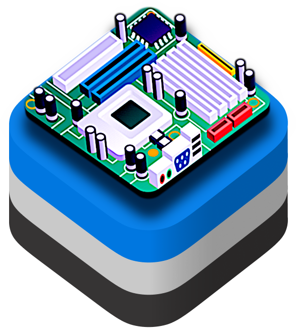

# VirtualizationKit

<div align="center">
  

  <p>Welcome to <strong>VirtualizationKit</strong><br>Easy Virtualization, tailored for macOS.</p>
</div>

## Introduction
`VirtualizationKit` is a macOS framework for easy virtualization, ready to accommodate different back-ends (for example, Apple Virtualization and QEMU). The primary goal is to offer a streamlined interface to manage virtual machines without needing to deal with the higher complexity that comes with standard virtualization solutions.

> [!NOTE]
> VirtualizationKit is **closed source** but freely available **without any paywall** in the *releases* section of this repo, and distributed using the **.xcframework** format, accompanied by the framework's own license.

---

## Design Implications
- A **minimal** and **simple to use** API that wraps the complexity of virtualization and reduces boilerplate code.
- Defaults that *“just work”* for the majority of use cases, from basic Linux VMs to more complex setups.
- Avoids **redundancy**, by not replicating advanced scenarios and use cases from the various back-ends.
- Currently optimized around Apple Virtualization. Broader hypervisor support is on the roadmap.

> [!TIP]
> **Target Audience**
> - **Developers new to Virtualization**: Gentle learning curve for those unfamiliar with system-level APIs.
> - **Teams seeking quick setup**: When spinning up VMs should be simple and repeatable, without fuss.
> - **Users wanting abstraction**: Consistent, streamlined API over multiple vendor-specific solutions.

---

## Potential API Design Goals

> [!WARNING]
> To be able to use this framework, please make sure your system meets the following requirements:
> 
> - **Processor**: Apple Silicon (M1, M2, or newer)   
> - **Operating System**: macOS Sonoma 14.0 or later

### Helper Objects and Methods
- Encapsulate complex tasks in user-friendly functions and data structures.

**Example (using Apple as a concrete backend and Combine for state subscriptions):**
```swift
import VirtualizationKit
import Combine

// 1. Create a simple template
let myAwesomeTemplate = Template(
    name: "MySampleVM",
    operatingSystem: .linux,
    networkTopology: .nat(),
    performancePreset: .balanced
)

// 2. Initialize an Apple-based VM
let vm = AppleVirtualMachine(template: myAwesomeTemplate)

// 3. Subscribe to state updates
var cancellables = Set<AnyCancellable>()
vm.stateSubject
    .sink { state in
        switch state {
        case .install(let progress): print("Installation at: \(progress)")
        case .running:               print("VM is running")
        case .stopped:               print("VM stopped")
        }
    }
    .store(in: &cancellables)

// 4. Perform installation asynchronously
Task {
    do {
        try await vm.execute(action: .install)
        print("Installation completed successfully!")
    } catch {
        print("Installation failed: \(error.localizedDescription)")
    }
}
```

### Simplified Management
- Ready-to-use configurations for common virtualization needs—like typical CPU, memory, and disk settings.
- Mask low-level error codes with approachable descriptions and actionable suggestions.

  **Example:**
  ```swift
  do {
      try await vm.execute(command: .start)
  
  } catch {

      // Prints an error description that is actually useful like
      // "The Virtual Machine has been created using a  macOS 15.2
      //  restore image, but the currently selected image’s version is 12.6"
      print("Failed to start VM: \(error.localizedDescription)")
  }
  ```
---
## Contact

For any inquiries or feedback, please feel free to contact me at <a href="mailto:help@grocco.org">help@grocco.org</a>

